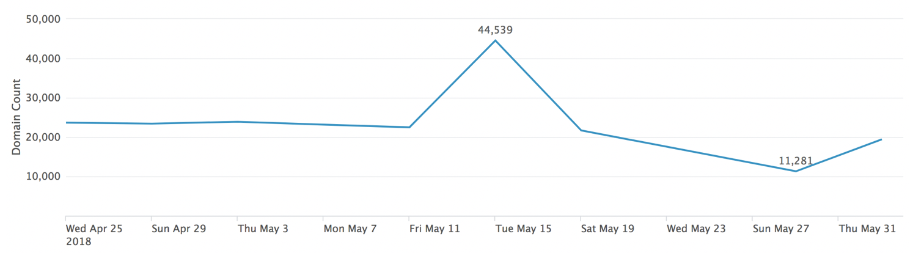
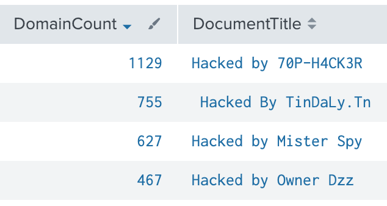
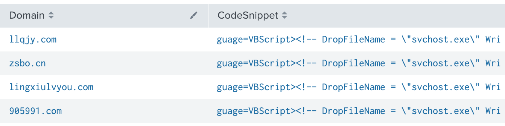
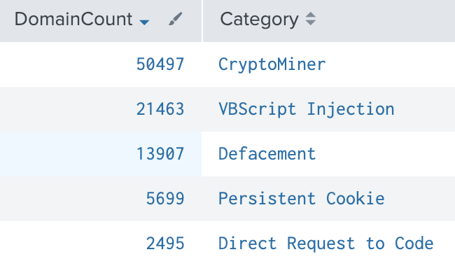
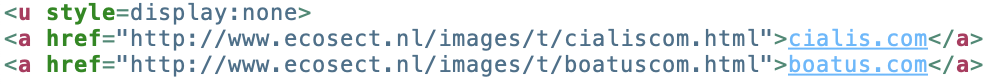
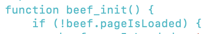
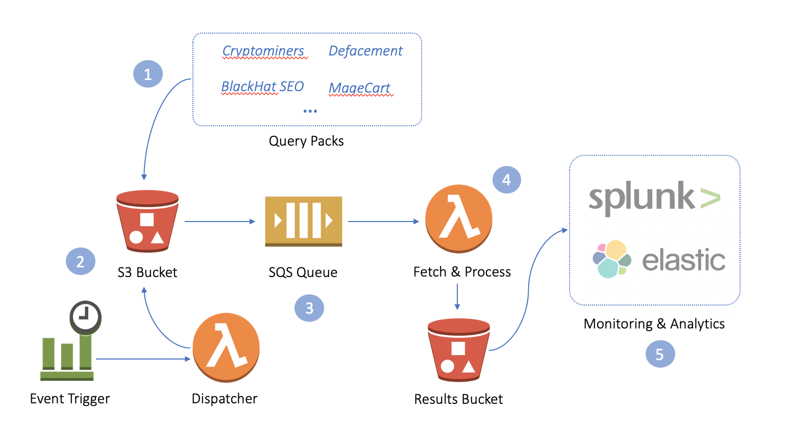

# PW3Query

PW3Query is a serverless query agent and repository for <a href="https://publicwww.com/">PublicWWW</a> with a focus on proactively generating threat intelligence related to web compromises.

PW3Query is deployed to your own AWS account in the matter of minutes. Query packs containing PublicWWW search patterns are processed on a regular interval, enriched with contextual fields, and output in JSON format to S3 for analysis and monitoring. You ingest the results with your own data analysis tools (Splunk, ElasticSearch, etc) to discover compromised sites, research trends, and track compromised infrastructure over time. 

**NOTE:** *PublicWWW is not owned, operated, or affiliated with Cisco. Cisco CSIRT has benefited from using PublicWWW and this tool, PW3Query, is how we make the most of the service.* 

# Example Use Cases
|    | 
  |
  |
|:---:|:---:|:---:|
| Timeseries Trend - Domains hosting a Coinhive Miner | Defaced Websites | Domains w/VBScript dropping fake svchost.exe 

<br />

|    | 
  |
  |
|:---:|:---:|:---:|
| Unique Domains per Category (5 shown) | BlackHat SEO Injection - Hidden anchor tags | Websites w/ BeEF Hook |

# Get Started
Prerequisites:
* <b>PublicWWW API Key</b> - Sign up at publicwww.com and select a plan (free tier is avialable).
* <b>AWS CLI</b> - Download and configure the AWS CLI (version >= 1.16 required). Instructions https://docs.aws.amazon.com/lambda/latest/dg/setup-awscli.html.

Installation:
1. <b>PublicWWW API Key:</b> Open "deploy.sh" and look for ```APIKEY=<yourkey>```. Replace ```<yourkey>``` with your PublicWWW API key.
2. <b>Deploy AWS Infrascture:</b> Run “bash deploy.sh” at the command line to automatically deploy the required infrastructure to your AWS account. 
3. <b>Data Ingestion:</b> An AWS Access Key & Secret Key combo with read permissions on the ```pw3query/results``` S3 bucket has been provided in the output for use with the data analysis tool of your choice. Output is stored in the JSON lines format (newline delminted JSON). You'll need to setup an S3 input with this access key. Here are links to a few popular data analysis tools: 
    * <a href="https://docs.splunk.com/Documentation/AddOns/released/AWS/S3">Configure Splunk S3 Input</a>
    * <a href="">Configure ElasticSearch S3 Input</a>

You're all set! Now you can add queries or query packs (see "Query Packs") and analyze/monitor the output with Splunk, ElasticSearch, or the tool of your choice.

NOTE: Queries are dispatched every 4 days - this is how often PublicWWW indexes new data. Additionally, if a query pack is updated it will automatically be dispatched for processing.
# Architecture


1. Search patterns are organized into query packs and uploaded to the "pw3query/packs" S3 bucket. 
2. Query packs are dispatched for processing every 4 days (which is how often pages are re-indexed by PublicWWW), or whenever there is a change to a query pack. 
3. The queue holds search patterns waiting for processing.
4. Search results are “fetched” from PublicWWW, enriched with contextual data provided in the query pack, and saved in JSON format to the "pw3query/results" S3 bucket. 
5. Your log management solution (Splunk, ElasticSearch, etc) ingests the results for you to analyze.

# Query Packs
Search patterns are organized into query packs. For example, all cryptominer patterns are organized into the cryptominer.conf query pack. Individual queries within a pack contain four fields:

   <u>query</u>: the search pattern dispatched to PublicWWW (this should be tested via the PublicWWW interface before being added to a query pack).  
   <b>category</b>: Great for metrics and analytics, and can be whatever you want it to be.  
   <b>notes</b>: Analyst notes for enrichment.  
   <b>snippet</b>: "yes/no" include the PublicWWW code snippet with results, only available up to a certain # of returned rows (depends on your API plan).
   
Upload new/modified query packs to the "pw3query/packs" S3 bucket. New or modified query packs will automatically be processed.

```json
{
    "queries": {
        "coinhive_cryptominer": {
            "query": "\"/lib/coinhive.min.js\"",
            "category": "CryptoMiner",
            "notes": "Coinhive is a JavaScript miner for Monero Blockchain.",
            "snippet": "no"
        },
        ...
    }
}
```


# Analyzing Results
After ingesting the data (see Getting Started: Installation), results can be queried and analyzed the same way you would any other datasource. Here are a few Splunk examples:

Timeseries trend showing the # of domains over time hosting cryptominers (click visulization after running the query, and select time-series)
index=<index_name> sourcetype="<sourcetype>" "*crypto*" earliest=-365d | dedup domain | timechart span=4d count


Top five categories
index=<index_name> sourcetype="<sourcetype>" earliest=-365d | dedup category,domain | stats count by category  | rename count AS DomainCount,category AS Category | head 5

# Alternatives
Your SIEM or data analysis tool probably has REST API input capabilities. You can use this directly and avoid using PW3Query, but PW3Query makes maintaining a repo of queries easier.

# Limitations
PW3Query is limited by PublicWWW's API capabilities and the PublicWWW plan you subscribe to. Here are some of those limitations:
* The query language is rather simple, limiting search patterns to keyword terms and simple regex extractions.
* The number of searches you can run per day depends on your PublicWWW API plan.
* The number of code snippets you can output depends your PublicWWW API plan.
* PublicWWW recommends waiting 1 minute between each API call, so the PW3Query agent was designed to respect this guideline.
* PublicWWW re-indexes data every 4 days - in other words, the data is updated every 4 days which leaves a time gap if you are hoping to perform daily queries. 

# Contributions
Contributions are welcome, especially adding/updating search patterns and query packs! To contribute code: fork the repo, make changes, and submit a pull request.  

Contributions you write yourself should be licensed under the BSD license. If you wrote code as part of work for someone else (like a company), you must ensure that you have the proper rights and permissions to contribute the code under the terms of the BSD license. 
